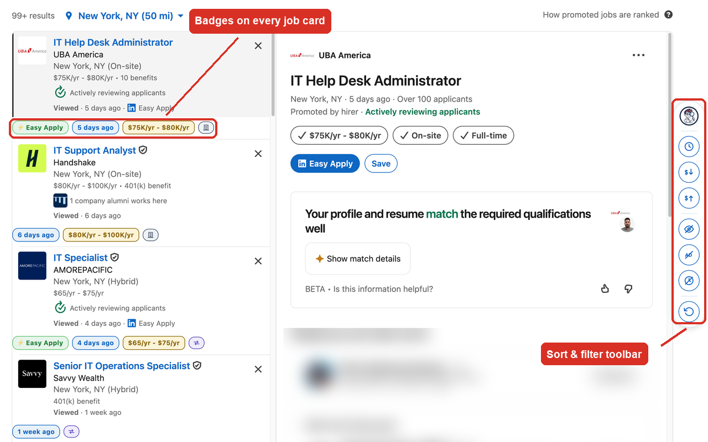
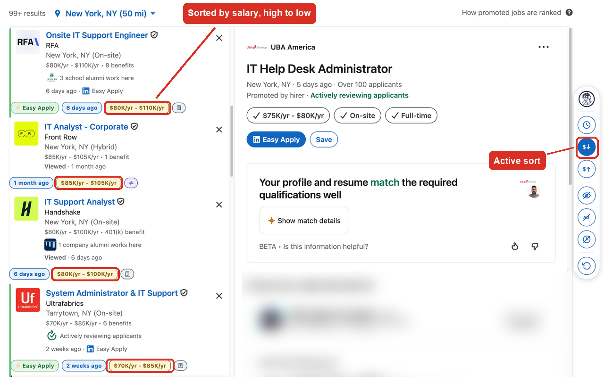

  

<h1 align="center">Loupa</h1>

  <strong>See more in every LinkedIn job search.</strong> 
  Posting dates, salary and workplace badges, plus one-click sorting and filtering.

  <a href="https://chromewebstore.google.com/detail/loupa/jkijhchgpdafmmalnfneiojdafakjghf">
    <strong>Install from the Chrome Web Store →</strong>
  </a>
  &nbsp;·&nbsp;
  <a href="https://leomar02.github.io/loupa-extension/">Website</a>
  &nbsp;·&nbsp;
  <a href="https://leomar02.github.io/loupa-extension/privacy.html">Privacy</a>

---

## Why

I built Loupa while job hunting, because I kept losing track of what I'd already looked at.

A LinkedIn results page tells you less than you'd think. You scroll past a role and can't
remember whether you opened it last Tuesday. The posting date is buried at the bottom of
the card, or missing entirely. A good chunk of what you're reading is promoted. Salary is
there sometimes, in small grey text, if you go looking.

Loupa puts that back where you can see it.

## Badges on every job card

| Badge | What it shows |
| --- | --- |
| Posted date | How old the listing is, or `No date` when LinkedIn hides it |
| Salary | The range and pay period, when the listing has one |
| Workplace | Remote, hybrid, or on-site, as an icon |
| Easy Apply | Whether it's a quick apply |

## Sorting and filtering

A floating rail sits at the edge of the results page.

| Control | What it does |
| --- | --- |
| Clock | Newest postings first; undated ones sink to the bottom |
| `$↓` / `$↑` | Sort by salary, high to low or low to high |
| Crossed-out eye | Unviewed first, so anything you've opened drops down |
| Crossed-out AD | Hide promoted listings |
| Crossed-out clock | Hide listings with no posting date |
| Reset | Back to LinkedIn's original order |

Sorts and filters combine. The setup I use most is promoted hidden, unviewed first,
highest paying at the top, which usually turns a full page of results into a handful
worth reading.

Salary sorting normalizes pay periods (hourly ≈ 2,080 hrs/yr, monthly × 12) and compares
the top of each range, so an hourly rate is ranked fairly against an annual salary.

## How it works

Sorting is visual only. It reorders cards on screen with the CSS `order` property rather
than moving anything in the page, so LinkedIn's infinite scroll keeps working and nothing
is deleted or permanently hidden. Reload the page and you're back to LinkedIn's own order.

Job cards are found through stable anchors rather than LinkedIn's frequently-changing CSS
class names, which keeps it working across their UI updates. Loupa supports both the
classic job search and the newer AI-powered one, which are built quite differently
underneath.

## Privacy

Loupa collects nothing. No analytics, no tracking, no cookies, no accounts, and no network
requests of its own. Everything happens locally in your browser.

[Full privacy policy →](https://leomar02.github.io/loupa-extension/privacy.html)

## Support

Found a bug, or a page layout Loupa doesn't handle? Use the **Support** tab on the
[Chrome Web Store listing](https://chromewebstore.google.com/detail/loupa/jkijhchgpdafmmalnfneiojdafakjghf).
A screenshot and the search page you were on makes it much faster to fix.

## About this repository

This repo hosts Loupa's website and privacy policy, published with GitHub Pages at
[leomar02.github.io/loupa-extension](https://leomar02.github.io/loupa-extension/).
The extension itself is distributed through the Chrome Web Store; its source is kept in a
separate private repository.

---

Not affiliated with, endorsed by, or sponsored by LinkedIn. LinkedIn is a trademark of
LinkedIn Corporation.
